# Execution Plan

## Detailed Analysis Summary

### Change Impact Assessment
- **User-facing changes**: Yes — 고객 주문 UI, 관리자 대시보드 UI 신규 구축
- **Structural changes**: Yes — 전체 시스템 신규 설계 (Greenfield)
- **Data model changes**: Yes — 전체 데이터 모델 신규 설계 (Store, Table, Menu, Order 등)
- **API changes**: Yes — 전체 API 신규 설계 (고객용 + 관리자용 REST API)
- **NFR impact**: Yes — 실시간 통신(SSE), 인증(JWT), 보안(SECURITY-01~15)

### Risk Assessment
- **Risk Level**: Medium
- **Rollback Complexity**: Easy (Greenfield — 기존 시스템 없음)
- **Testing Complexity**: Moderate (실시간 통신, 인증, 세션 관리 테스트 필요)

---

## Workflow Visualization

```mermaid
flowchart TD
    Start(["User Request"])
    
    subgraph INCEPTION["INCEPTION PHASE"]
        WD["Workspace Detection<br/>COMPLETED"]
        RA["Requirements Analysis<br/>COMPLETED"]
        US["User Stories<br/>COMPLETED"]
        WP["Workflow Planning<br/>COMPLETED"]
        AD["Application Design<br/>EXECUTE"]
        UG["Units Generation<br/>EXECUTE"]
    end
    
    subgraph CONSTRUCTION["CONSTRUCTION PHASE"]
        FD["Functional Design<br/>EXECUTE"]
        NFRA["NFR Requirements<br/>EXECUTE"]
        NFRD["NFR Design<br/>EXECUTE"]
        CG["Code Generation<br/>EXECUTE"]
        BT["Build and Test<br/>EXECUTE"]
    end
    
    Start --> WD
    WD --> RA
    RA --> US
    US --> WP
    WP --> AD
    AD --> UG
    UG --> FD
    FD --> NFRA
    NFRA --> NFRD
    NFRD --> CG
    CG --> BT
    BT --> End(["Complete"])
    
    style WD fill:#4CAF50,stroke:#1B5E20,stroke-width:3px,color:#fff
    style RA fill:#4CAF50,stroke:#1B5E20,stroke-width:3px,color:#fff
    style US fill:#4CAF50,stroke:#1B5E20,stroke-width:3px,color:#fff
    style WP fill:#4CAF50,stroke:#1B5E20,stroke-width:3px,color:#fff
    style AD fill:#FFA726,stroke:#E65100,stroke-width:3px,stroke-dasharray: 5 5,color:#000
    style UG fill:#FFA726,stroke:#E65100,stroke-width:3px,stroke-dasharray: 5 5,color:#000
    style FD fill:#FFA726,stroke:#E65100,stroke-width:3px,stroke-dasharray: 5 5,color:#000
    style NFRA fill:#FFA726,stroke:#E65100,stroke-width:3px,stroke-dasharray: 5 5,color:#000
    style NFRD fill:#FFA726,stroke:#E65100,stroke-width:3px,stroke-dasharray: 5 5,color:#000
    style CG fill:#4CAF50,stroke:#1B5E20,stroke-width:3px,color:#fff
    style BT fill:#4CAF50,stroke:#1B5E20,stroke-width:3px,color:#fff
    style INCEPTION fill:#BBDEFB,stroke:#1565C0,stroke-width:3px,color:#000
    style CONSTRUCTION fill:#C8E6C9,stroke:#2E7D32,stroke-width:3px,color:#000
    style Start fill:#CE93D8,stroke:#6A1B9A,stroke-width:3px,color:#000
    style End fill:#CE93D8,stroke:#6A1B9A,stroke-width:3px,color:#000
    linkStyle default stroke:#333,stroke-width:2px
```



### Text Alternative
```
INCEPTION PHASE:
  1. Workspace Detection      — COMPLETED
  2. Requirements Analysis     — COMPLETED
  3. User Stories              — COMPLETED
  4. Workflow Planning         — COMPLETED
  5. Application Design        — EXECUTE
  6. Units Generation          — EXECUTE

CONSTRUCTION PHASE:
  7. Functional Design         — EXECUTE (per-unit)
  8. NFR Requirements          — EXECUTE (per-unit)
  9. NFR Design                — EXECUTE (per-unit)
  10. Infrastructure Design    — SKIP
  11. Code Generation          — EXECUTE (per-unit)
  12. Build and Test           — EXECUTE
```

---

## Phases to Execute

### INCEPTION PHASE
- [x] Workspace Detection (COMPLETED)
- [x] Requirements Analysis (COMPLETED)
- [x] User Stories (COMPLETED)
- [x] Workflow Planning (COMPLETED)
- [ ] Application Design — **EXECUTE**
  - **Rationale**: 전체 시스템 신규 설계. 컴포넌트 식별, 서비스 레이어 설계, 컴포넌트 간 의존성 정의 필요
- [ ] Units Generation — **EXECUTE**
  - **Rationale**: 복잡한 시스템으로 다수의 작업 단위(Unit)로 분해 필요. 고객 UI, 관리자 UI, API, DB 스키마 등

### CONSTRUCTION PHASE (per-unit)
- [ ] Functional Design — **EXECUTE**
  - **Rationale**: 새로운 데이터 모델, 비즈니스 로직(주문 상태 전이, 세션 관리), API 설계 필요
- [ ] NFR Requirements — **EXECUTE**
  - **Rationale**: 실시간 통신(SSE), JWT 인증, 보안 규칙(SECURITY-01~15), 성능 요구사항 존재
- [ ] NFR Design — **EXECUTE**
  - **Rationale**: NFR Requirements에서 도출된 패턴을 설계에 반영 필요
- [ ] Infrastructure Design — **SKIP**
  - **Rationale**: 배포 환경 미정(Q5: D). 개발 우선, 인프라는 추후 결정. 로컬 개발 환경만 필요
- [ ] Code Generation — **EXECUTE** (ALWAYS)
  - **Rationale**: 구현 필수
- [ ] Build and Test — **EXECUTE** (ALWAYS)
  - **Rationale**: 빌드 및 테스트 필수

### OPERATIONS PHASE
- [ ] Operations — **PLACEHOLDER**
  - **Rationale**: 향후 배포/모니터링 워크플로우 확장 예정

---

## Success Criteria
- **Primary Goal**: 고객이 테이블에서 메뉴를 탐색하고 주문할 수 있으며, 관리자가 실시간으로 주문을 모니터링하고 관리할 수 있는 MVP 시스템
- **Key Deliverables**:
  - Next.js 풀스택 애플리케이션 (고객 UI + 관리자 UI + API)
  - SQLite 데이터베이스 스키마 및 시드 데이터
  - SSE 기반 실시간 주문 알림
  - JWT 기반 인증 시스템
  - 핵심 비즈니스 로직 단위 테스트
- **Quality Gates**:
  - 모든 SECURITY 규칙 준수 (SECURITY-01~15)
  - INVEST 기준 충족 User Stories
  - 핵심 비즈니스 로직 단위 테스트 통과
